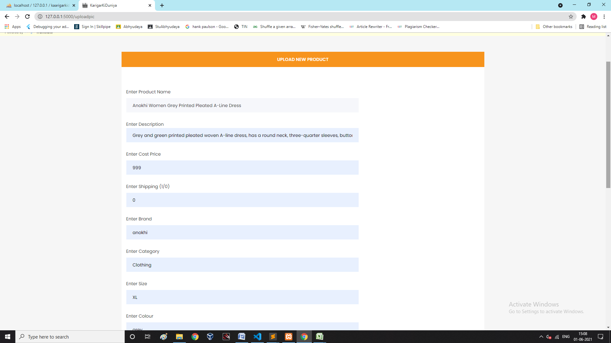

# KarigarKiDuniya---An-E-commerce-Portal

## Abstract 
The vandalization and agitation caused by this pandemic is foreign to none. This long-time lockdown has definitely been dreadful for all the sole bread earners of the family and has led to psychosocial difficulties for vulnerable populations.\
Nevertheless to say the community of our society that has been affected the most are the local vendors and sellers (including sellers from the economically undeveloped areas of India). Local shops, marts, stores being closed, their livelihood came to a halt. 
This project aims at providing the sellers an easy gateway to connect with the consumers by selling their products (Cloth line) online through the website, which will not only provide them a better and a wider reach to a huge audience but also relieve them of various other nitty-gritty of selling, by the various functionalities provided.

## Objective
To develop an E-commerce portal to help out the local vendors belonging to the economically weaker sections of our country by bridging barriers between them and the customers using technology and also help them reach a larger audience. 

## Tech Stack Used
Frontend - HTML, CSS, Bootstrap\
Backend - Flask (Python)\
Database - MySQL

## Features Implemented
- Price Prediction Model for the vendors so as to help them value their products profitably
- Search by Image Feature for customers
- Market Basket Analysis to recommend products frequently bought together
- Login using OTP
- Maps API to help sellers easily find the nearest location to send their products
- Translation of webpages into various languages
- Various Searching/ Sorting options including Voice Search
- Dummy Payment Gateaway

## Screenshots
 ##### Customer Dashboard
 
 
 ##### Products in each category
 
 
 ##### Market Basket Analysis
 
 
  ##### Seller Products upload
 
 
   ##### Price Prediction for seller
 

   ##### View previously uploaded products
 
 
 *For more implementation images, checkout the screenshots folder.*
